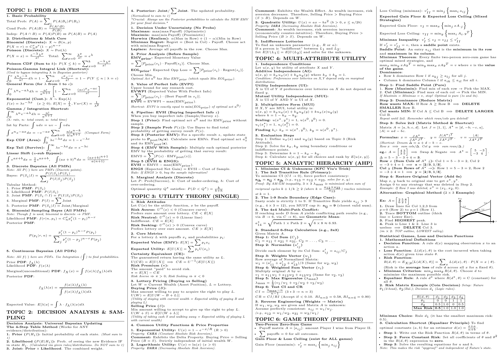
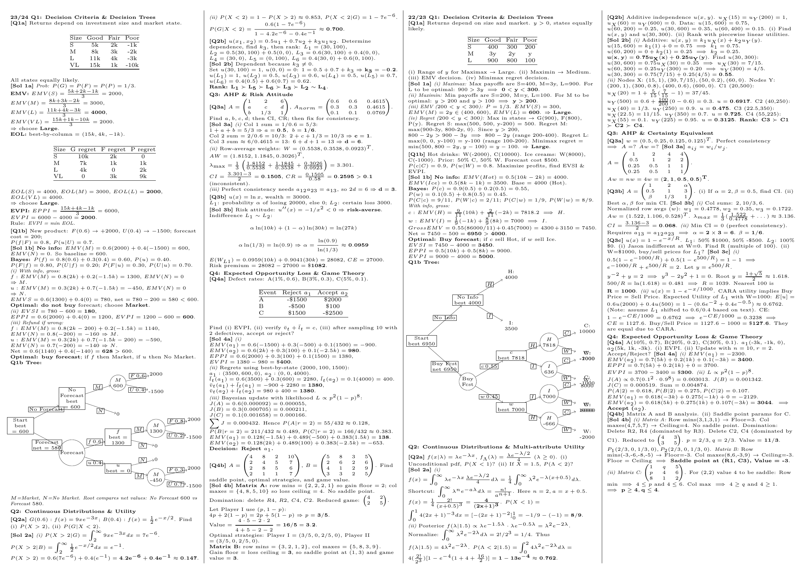

# AMA4840 Cheatsheet

[View / download PDF](ama4840cheatsheet.pdf)

A comprehensive LaTeX cheatsheet for AMA4840 (PolyU Applied Mathematics coursework).

## Overview

This repository contains a comprehensive reference for AMA4840. **Page 1** covers all course content, key concepts, and detailed sample solutions. **Page 2** includes past paper questions with complete answers for exam preparation and practice.

## Contents

- **ama4840cheatsheet.txt** - LaTeX source file containing the cheatsheet content
- **[ama4840cheatsheet.pdf](ama4840cheatsheet.pdf)** - Compiled PDF ready to view or download

## Usage

1. Copy the content from `ama4840cheatsheet.txt`
2. Paste it into your LaTeX document
3. Compile to PDF using your preferred LaTeX compiler (e.g., `pdflatex`, `xelatex`, etc.)
